Chris Biscardi: 00:00 **The first thing that we're going to do to is actually design the images in Figma.** Now, Ryan Warner has provided this nice template for us so that we don't have to do a bunch of the setup work for the sizing and things like that, so we're going to take a look at it.

00:16 [This takes us to the Figma community resources page](https://www.figma.com/community/file/820337605519256142) for the template, at which point we can go up to the right if we already have a Figma account, which you can see that I do in the top left -- I am actually signed in right now. We can go up to the top right and click 'Duplicate'.

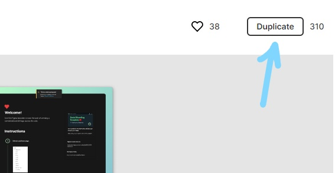

00:30 **This will sign us into our Figma account and also set us up with a duplicate of the template**. Now, this template has an intro page if you want to read through that, but what we're going to do is go down to Twitter and take a look.

00:45 It looks like there isn't any Open Graph image here, so we're going to go down to Open Graph Image. **An Open Graph image is what we use to preview on Twitter, Discord, Slack, things like that**.

00:56 If we zoom in here a little bit, you can see that there's the preview image for Twitter for a large summary, Discord unfurl, and as well as the Slack unfurl. We're going to be spending most of our time in this Open Graph image over here, which will actually translate to these images over here automatically for us.

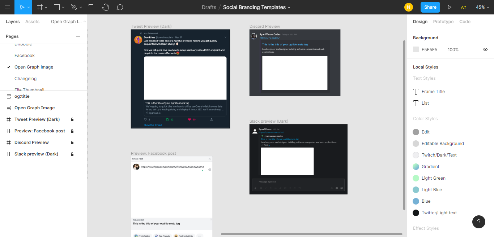

01:15 I've got an idea of what I want for this Open Graph image, which is a nice background with a flat foreground and then a couple words inside of the Open Graph image that we're going to use. I want the, say, **title of my blog post, the tags that are part of the blog post**. If I'm writing a React piece, or something like that, I want it to be tagged with React and not show up on the Open Graph image.

01:39 I'm going to leave my name in there as well. I think I'm going to leave my name in as a Twitter username rather than my actual name, but we'll see. I'm on the site called [Gradient Magic](https://www.gradientmagic.com/). It's just a site to **quickly pick a potentially interesting background** for the total Open Graph card.

01:58 In this case, I'm going to go with the complex angular gradient. I think I like this one, so I'm going to make it bigger. Now, in Figma, we only have a `1,200 x 630` canvas. If we look at the size of our canvas here, we have `1,200 x 630` for this white square. To get the image, what I can do is I can open the inspect element console. You'll see that there's this large preview div.

02:22 **This large preview div can be set to a height of 630 pixels.** We don't want to override the gradient, so we're going to click in here again and do a width of **1,200 pixels**. That shortens everything. We still have this X in the corner. We don't really need to care about that too much, but there is something we do need to care about.

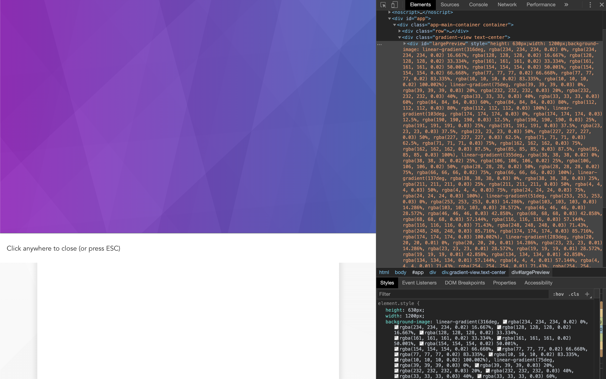

02:44 We can put this to the side. If you open the little drop down here, you can put the dev tools to the side, and then we can see that we can click anywhere to close here, which is actually part of the preview.

02:56 It's part of our `1200 x 630`, which means that we need to go in here and delete that element. We find out that the close button is actually right here as well, so we'll delete that too. Now, we're on the large preview and that's the size we need it to be.

03:09 If we hit `Cmd + P`, type `>` symbol, and then we start typing `>screenshot`, we get a couple of screenshot options. The first one is going to be `capture node screenshot`, which is going to be the one that we want.

03:23 If we click it, you can see that we now have a download here of the gradient that we just captured. This makes it really nice because now we have a `1200 x 630` image. We don't have to worry about adjusting it really at all. It just fits right in.

03:36 **Figma allows us to just drag and drop that image**, so we went, we got a gradient, we sized it to the appropriate size. We downloaded it by taking a screenshot through the console and I've now placed it into our Figma.

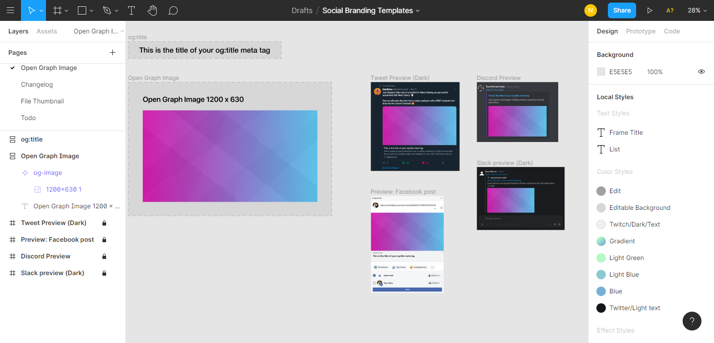

03:49 Also note that as we make adjustments to this master, it shows up in all of the previews so we can get a good look for what it might feel like to actually see our Open Graph image.

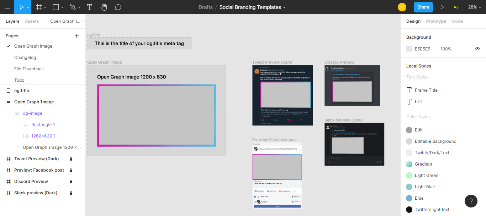

04:04 Now, I'm just going to draw a rectangle here. I'm going to make the width `1160px` and the height `590px` just like our canvas size. I don't want this to actually be as big as the canvas, so what I'm going to do is I'm going to take approximately `40px` off each of them.

04:17 I'm going to go with `1160px` and `590px`. I'm going to take this rectangle and drag it into and let Figma help me center the actual master template. Now, we have a background that goes from pink to blue. It's kind of nice. It's got a little bit of interestingness in the middle of it.

04:38 Now, we've got this interesting rectangle centered in our Open Graph image, which means that we have some nice borders around the content area for our text. **This is important because gradients usually don't provide really good background for actual reading of text**. It can work for headers, but it probably won't work for any of our smaller text.

04:57 You can get it to work on a raw gradient if you know what you're doing. We'll go into the `fill` for the rectangle and choose the `eyedropper` tool. The `eyedropper` tool allows us to pick a color from the canvas. I'm going to go with the light blue here and then we're going to go into HSL.

05:11 **Modifying the lightness, the high end at `100` is very white, the low end is very dark**. In this case, we've taken a color blue from our background and then made it either extremely light but not quite white or extremely dark and not quite black.

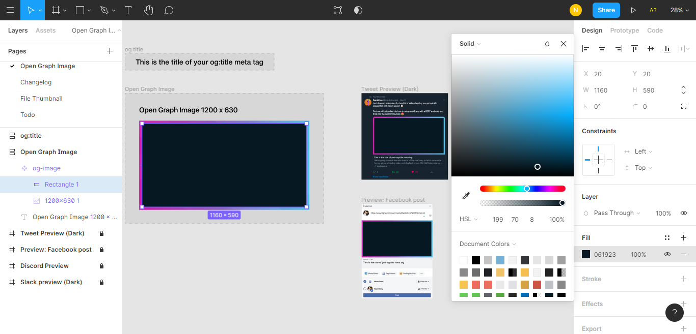

05:26 **This gives us a bit of color to tie front panel into the background colors.** Now, I like the dark look a little bit more than the light look, so I'm going to go with the dark color here. If we look at the preview images, we can see that Twitter has these little rounded corners on the end. I don't quite like the fact that our rectangle sits in here and is pointed at those rounded corners.

05:46 What I'm going to do, I'm going to click on this rectangle and go up to the border radius. **Figma calls this corner radius, but if you're used to working with CSS, you will know this is border radius**. Also, note that we can go independent corners if we click this little box next to the corner radius. In this case, we'll go top-left. We'll say maybe `15`. That looks about right.

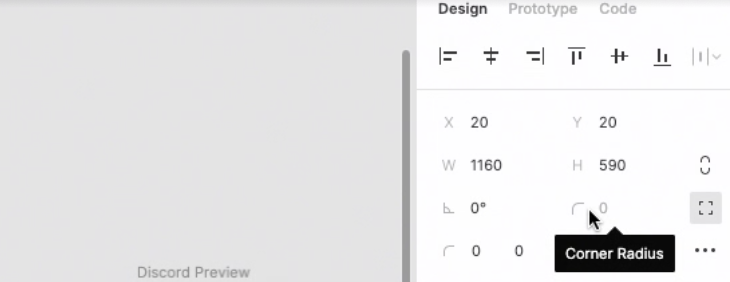

06:06 We're going to the top-right. You'll notice that as we click into each of these little boxes, what corner we're working on shows up as the icon here. If you forget, like I just did, you can click in. Now, were at `15, 15, 0, 0`, which in my opinion makes it look a lot nicer in the context of the unfurl and Twitter.

06:26 **We also note that it doesn't look bad in any of the other examples because it even slacks around the corners of its own a little bit**. Now we've got an image that is a good background for us, we're going to have to add some text. We can go to the top-left and hit `T`, or `T` on the keyboard, and start drawing text in.

06:45 We need a good blog post name, so I've typed in here, `"How I made Open Graph images with serverless functions"`. Note that the text is very small, so we've selected it all. It's also very dark. I'm going use the same trick I used before with the color. I make it about a `95` percent lightness off of the background rectangle. This gives us `E9F5FB` as our fill.

07:06 The text is still very small, so we're going to bump this up to maybe `65px`. We've going with the nice, bold or black font weight. This is OK. I don't love the Roboto font, but we're not really looking for the perfect font right now. Because **we're going to translate this into a React component later**, the actual font choice here, as long as it's a Sans Serif, I don't particularly care about.

07:29 **You might care a lot more if you're going to manually export these images yourself.** We have an Open Graph card with a title on it. It fills about `60%` of the card width, but we still need to add our name and the tags of this post. I'm going to anchor these on the bottom of the card, give a little bit of separation between all of the content.

07:44 We'll go back to the text tool, which we can do with `T` on the keyboard, or in the `top-left`. I'll draw another box and put in some random tags for this post, say maybe _"React, Serverless, Figma"_. The text is still big because it's similar to what we had before. We'll go and make it smaller. `14px` seems to be a little too small, so let's bump up to `24px`.

08:05 We also need to change the font color. In this case, the colors are so small. I'm just going to make these white to pull it off a little more off the background. Note that we've lined the left side of the start of the tags with the start of the title. **This gives us a consistent spacing off the left-hand side, which will match on the right-hand side.**

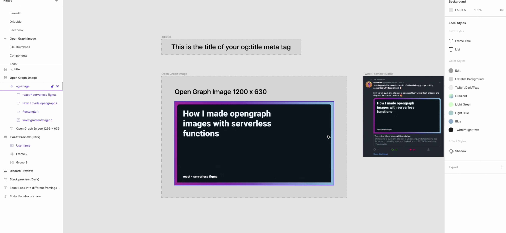

08:23 Note that in this case, the separator I've used is just a star on the keyboard. I don't really like that, so I'm going to choose something else. I search for [UTF-8 dot](https://www.compart.com/en/unicode/U+2022) because I know there happens to be a dot. I can go to the page, copy it out, and go back to Figma. **Inside of my text box, I can now use these dots,** which are much more centered and much more smooth than the dots I was using before.

08:47 This could also be designed in some way, but we are actually going to use a text box when we convert this to a React component, so **I wanted to use a UTF-8 element rather than a designed circle**. Note that because this is going to be converted to an image, the UTF-8 element is fine, but if we were going to use this as text for accessibility purposes, we would need to use something that probably wasn't a UTF-8 middle dot.

09:09 What I've done here is I've just copied and pasted the text, which you'll notice that is still anchored to the left. We've got these dotted lines going up into the side. We'll first change the text to be `@chrisbiscardi`. This is my Twitter handle, so it's nice to have that in my social images.

09:24 **We'll align the text right using the text align right button on the right-hand side.** You can see that there's also a keyboard shortcut if you want to use that. You'll notice that this aligns the text to the right of our text box. Since we're working with the bottom of the text box, I'm also going to align this to the bottom.

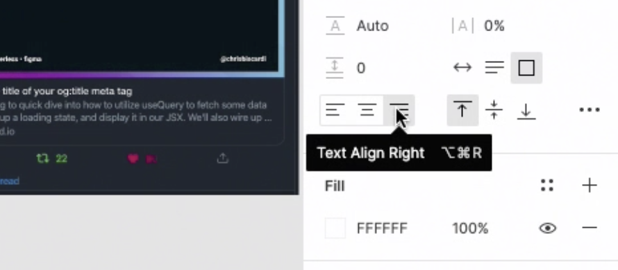

09:39 I'll have to do the same for the original text, so that they're still on the same baseline. Now we've selected both of them, we can move them up and down in sequence, keeping the same baseline. **This allows us to adjust the padding between the text and the bottom of the box without having different spacing between the text and the bottom of the box**.

09:56 Now, we can see our Open Graph images starting to take shape. The text on the bottom might be a little too small. This might be the size of the Open Graph image, so I think what I want to do is I want to bump the font size on the text for each of these.

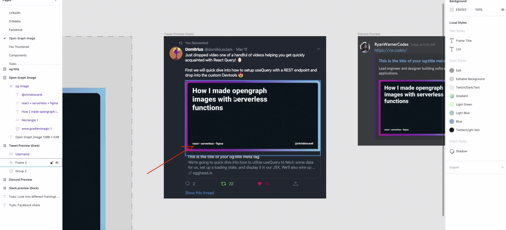

You can see that if I have Twitter maybe on half size of my screen, it's a little bit hard to read the tags and the author name.

10:16 While I don't want these to take away from the original title, we can make them a little better and make them a little bit more readable. Now, because they're starting to get to the same size as the title, what I'm going to do is I'm going to take the font weight and scale it back.

10:30 **In this way, we have the same font being used for the title and for the additional information, but we've separated it out by making the title very bold and the regular content very thin comparatively**. Note this is a regular font weight. We're not actually going below about 400 if you think about this on a web level.

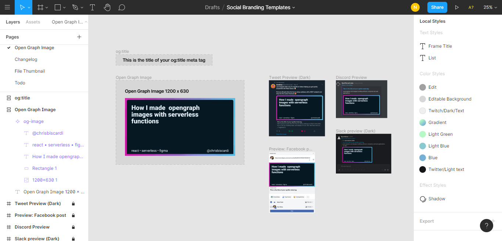

10:48 Now I'm reasonably happy with this, so I'm going to take this design and start implementing it as a React component. **Remember that what we did here was just scaffold out and place visually the ideas that we have.**

11:02 **This isn't the final design and it won't look exactly like this when we convert it to a React component**, so I haven't spent too much time on making sure the margins on each side are exactly the same pixels or things like that.

11:16 If this was going to be your final image and you were going to export it from Figma, you might want to spend more time on the details. In this case, I just wanted to place everything on the page and understand vaguely what I'm going for when I start building the React component.

11:30 **Again, the goal is to not spend too much time inside of Figma, but rather just get our ideas down on paper so that we can communicate them to anybody else that needs them**. Also, we have a reference for what we want to do when we build the React component.
