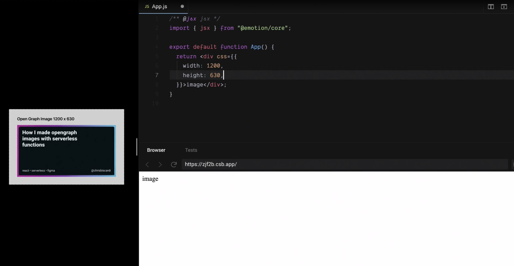
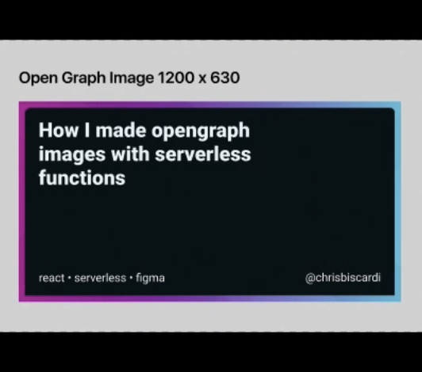
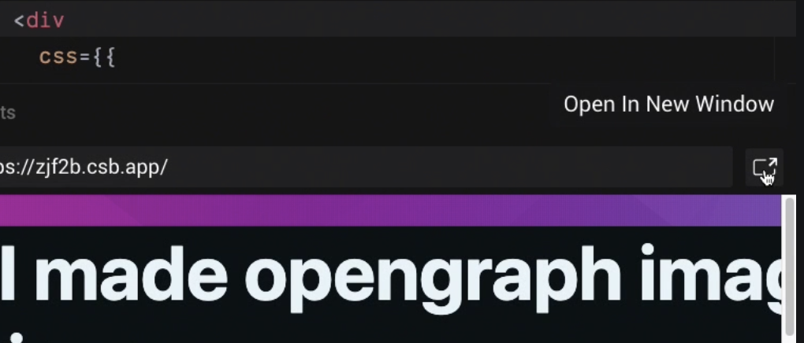

Chris Biscardi: 00:00 **The open-graph image layout that we created in Figma is on the left here. On the right, we have a CodeSandbox.** We'll [create a new React CodeSandbox](https://codesandbox.io/s/pp0jl9jzq) although you can do this with any technology that you want. This is not limited to React.

00:12 It's a little hard to see on the left so **we'll use a feature of Figma called Present**. Note that it comes up with the first item in our Figma template so we need to click once to go to the right to get to our open-graph image. We also need to go up to the top right to the percentage and do scale down to fit.

00:29 Now that we have a view of our template, we can scale it down as much as we want. **I'll let the CodeSandbox take up the rest of the screen while we work.**

00:35 The first thing we're going to do is import `JSX` from a [Emotion core](https://emotion.sh/docs/introduction). Emotion core hasn't been added as a dependency yet so we need to click the button and do that. We can also go into the `package.json` and add if we want to.

00:47 **We'll also use a pragma at the top of the file** to specify that we want the JSX that we're writing to convert into this `JSX` function instead of `react.createElement`. I'm using a CSS from JS library because later, we're going to take this code and put it inside of a browser inside of a serverless function.

```js
/** @jsx jsx */
Import React from "react"
import { jsx, Global } from "@emotion/core";
```

01:06 To pass in variables to change different things about, say, the background, it's **more useful to be able to do that straight through JavaScript than to have to rewrite CSS classes**. Since the function that we write won't be running in anybody's browser, we can use whatever we want.

01:20 We can enter [Zen mode](https://code.visualstudio.com/docs/getstarted/tips-and-tricks#_zen-mode) to get rid of the top bar and click on the menu on the left on the currently active Explorer pane to get rid of the sidebar. We'll keep the console around just in case. **We can also get rid of React because we're not using `createElement`.**

```js
/** @jsx jsx */
import { jsx, Global } from '@emotion/core'
```



01:33 **The CSS prop allows us to use all the features of CSS right in our JSX.** We'll set the `width` and the `height` to `1200` and `630`, which is the same size as our Open Graph image on the left. The first thing we want to do is get this gradient in as a background color for our `div`. If we switch back to the gradient magic page, we can copy CSS out that represents our background.

01:54 We weren't able to do this in Figma because Figma doesn't have CSS import. Now that we're working in CodeSandbox, **we can just use the CSS linear gradient instead**. Now, we've set a background image with our gradient.

```jsx
<div
      css={{
        width: 1200,
        height: 630,
        backgroundImage: `linear-gradient(131deg, rgba(186, 186, 186, 0.01) 0%, rgba(186, 186, 186, 0.01) 16.667%,rgba(192, 192, 192, 0.01) 16.667%, rgba(192, 192, 192, 0.01) 33.334%,rgba(48, 48, 48, 0.01) 33.334%, rgba(48, 48, 48, 0.01) 50.001000000000005%,rgba(33, 33, 33, 0.01) 50.001%, rgba(33, 33, 33, 0.01) 66.668%,rgba(182, 182, 182, 0.01) 66.668%, rgba(182, 182, 182, 0.01) 83.33500000000001%,rgba(211, 211, 211, 0.01) 83.335%, rgba(211, 211, 211, 0.01) 100.002%),linear-gradient(148deg, rgba(48, 48, 48, 0.01) 0%, rgba(48, 48, 48, 0.01) 16.667%,rgba(178, 178, 178, 0.01) 16.667%, rgba(178, 178, 178, 0.01) 33.334%,rgba(192, 192, 192, 0.01) 33.334%, rgba(192, 192, 192, 0.01) 50.001000000000005%,rgba(237, 237, 237, 0.01) 50.001%, rgba(237, 237, 237, 0.01) 66.668%,rgba(194, 194, 194, 0.01) 66.668%, rgba(194, 194, 194, 0.01) 83.33500000000001%,rgba(227, 227, 227, 0.01) 83.335%, rgba(227, 227, 227, 0.01) 100.002%),linear-gradient(138deg, rgba(146, 146, 146, 0.03) 0%, rgba(146, 146, 146, 0.03) 25%,rgba(33, 33, 33, 0.03) 25%, rgba(33, 33, 33, 0.03) 50%,rgba(46, 46, 46, 0.03) 50%, rgba(46, 46, 46, 0.03) 75%,rgba(172, 172, 172, 0.03) 75%, rgba(172, 172, 172, 0.03) 100%),linear-gradient(38deg, rgba(3, 3, 3, 0.03) 0%, rgba(3, 3, 3, 0.03) 16.667%,rgba(28, 28, 28, 0.03) 16.667%, rgba(28, 28, 28, 0.03) 33.334%,rgba(236, 236, 236, 0.03) 33.334%, rgba(236, 236, 236, 0.03) 50.001000000000005%,rgba(3, 3, 3, 0.03) 50.001%, rgba(3, 3, 3, 0.03) 66.668%,rgba(207, 207, 207, 0.03) 66.668%, rgba(207, 207, 207, 0.03) 83.33500000000001%,rgba(183, 183, 183, 0.03) 83.335%, rgba(183, 183, 183, 0.03) 100.002%),linear-gradient(145deg, rgba(20, 20, 20, 0.02) 0%, rgba(20, 20, 20, 0.02) 20%,rgba(4, 4, 4, 0.02) 20%, rgba(4, 4, 4, 0.02) 40%,rgba(194, 194, 194, 0.02) 40%, rgba(194, 194, 194, 0.02) 60%,rgba(34, 34, 34, 0.02) 60%, rgba(34, 34, 34, 0.02) 80%,rgba(71, 71, 71, 0.02) 80%, rgba(71, 71, 71, 0.02) 100%),linear-gradient(78deg, rgba(190, 190, 190, 0.02) 0%, rgba(190, 190, 190, 0.02) 20%,rgba(95, 95, 95, 0.02) 20%, rgba(95, 95, 95, 0.02) 40%,rgba(71, 71, 71, 0.02) 40%, rgba(71, 71, 71, 0.02) 60%,rgba(7, 7, 7, 0.02) 60%, rgba(7, 7, 7, 0.02) 80%,rgba(130, 130, 130, 0.02) 80%, rgba(130, 130, 130, 0.02) 100%),linear-gradient(293deg, rgba(213, 213, 213, 0.03) 0%, rgba(213, 213, 213, 0.03) 20%,rgba(220, 220, 220, 0.03) 20%, rgba(220, 220, 220, 0.03) 40%,rgba(146, 146, 146, 0.03) 40%, rgba(146, 146, 146, 0.03) 60%,rgba(57, 57, 57, 0.03) 60%, rgba(57, 57, 57, 0.03) 80%,rgba(120, 120, 120, 0.03) 80%, rgba(120, 120, 120, 0.03) 100%),linear-gradient(90deg, rgb(225, 15, 180),rgb(78, 198, 243))`,
      }}
    >
```

02:06 For our purposes, this is fairly large, so we're going to temporarily chop both values in half so that we can see more of it on the screen at the same time. **Before we ship, we'll want to change these values back.** There are a couple global styles we want to add.

02:18 You might be used to seeing these from a CSS reset or a normalized CSS file. We're setting `boxSizing: 'border-box',`. We're setting the `margin: 0`, and `padding: 0` which is fairly opinionated.

02:29 We've set the `fontFamily: 'system-ui',`. Remember that we used Roboto in our Figma template. We've also set a default font size here. **This is using the global component from Emotion**, which will inject the styles and apply them globally.

```jsx
import { jsx, Global } from '@emotion/core'

/** **/
;<Global
  styles={{
    '*': {
      boxSizing: 'border-box',
      margin: 0,
      padding: 0,
      fontFamily: 'system-ui',
    },
  }}
/>
```

02:41 If we ever didn't render this global component, the styles would get removed. Since we only render this once and it's not an application, this global component will never get removed. **The next thing we want to do is wrap this image text in a `div` of its own.**

02:57 We're creating this dark background area inside of our OpenGraph image. We can start with any arbitrary color to figure out that our size is not actually what we wanted to be, as you see this black bar at the top.

03:09 If we add a margin of `1rem`, we could see that we get the margin that we want from the sides, but the top actually pushes the entire thing down. We can fix this by setting an `position: "absolute",` for our bounding `div`. Now, we have our black box but it's quite thin and it doesn't fill the entire area we wanted to.

```jsx
<div
  css={{
    width: 1200,
    height: 630,
    backgroundImage: `linear-gradient(131deg, rgba(186, 186, 186, 0.01) 0%, rgba(186, 186, 186, 0.01) 16.667%,rgba(192, 192, 192, 0.01) 16.667%, rgba(192, 192, 192, 0.01) 33.334%,rgba(48, 48, 48, 0.01) 33.334%, rgba(48, 48, 48, 0.01) 50.001000000000005%,rgba(33, 33, 33, 0.01) 50.001%, rgba(33, 33, 33, 0.01) 66.668%,rgba(182, 182, 182, 0.01) 66.668%, rgba(182, 182, 182, 0.01) 83.33500000000001%,rgba(211, 211, 211, 0.01) 83.335%, rgba(211, 211, 211, 0.01) 100.002%),linear-gradient(148deg, rgba(48, 48, 48, 0.01) 0%, rgba(48, 48, 48, 0.01) 16.667%,rgba(178, 178, 178, 0.01) 16.667%, rgba(178, 178, 178, 0.01) 33.334%,rgba(192, 192, 192, 0.01) 33.334%, rgba(192, 192, 192, 0.01) 50.001000000000005%,rgba(237, 237, 237, 0.01) 50.001%, rgba(237, 237, 237, 0.01) 66.668%,rgba(194, 194, 194, 0.01) 66.668%, rgba(194, 194, 194, 0.01) 83.33500000000001%,rgba(227, 227, 227, 0.01) 83.335%, rgba(227, 227, 227, 0.01) 100.002%),linear-gradient(138deg, rgba(146, 146, 146, 0.03) 0%, rgba(146, 146, 146, 0.03) 25%,rgba(33, 33, 33, 0.03) 25%, rgba(33, 33, 33, 0.03) 50%,rgba(46, 46, 46, 0.03) 50%, rgba(46, 46, 46, 0.03) 75%,rgba(172, 172, 172, 0.03) 75%, rgba(172, 172, 172, 0.03) 100%),linear-gradient(38deg, rgba(3, 3, 3, 0.03) 0%, rgba(3, 3, 3, 0.03) 16.667%,rgba(28, 28, 28, 0.03) 16.667%, rgba(28, 28, 28, 0.03) 33.334%,rgba(236, 236, 236, 0.03) 33.334%, rgba(236, 236, 236, 0.03) 50.001000000000005%,rgba(3, 3, 3, 0.03) 50.001%, rgba(3, 3, 3, 0.03) 66.668%,rgba(207, 207, 207, 0.03) 66.668%, rgba(207, 207, 207, 0.03) 83.33500000000001%,rgba(183, 183, 183, 0.03) 83.335%, rgba(183, 183, 183, 0.03) 100.002%),linear-gradient(145deg, rgba(20, 20, 20, 0.02) 0%, rgba(20, 20, 20, 0.02) 20%,rgba(4, 4, 4, 0.02) 20%, rgba(4, 4, 4, 0.02) 40%,rgba(194, 194, 194, 0.02) 40%, rgba(194, 194, 194, 0.02) 60%,rgba(34, 34, 34, 0.02) 60%, rgba(34, 34, 34, 0.02) 80%,rgba(71, 71, 71, 0.02) 80%, rgba(71, 71, 71, 0.02) 100%),linear-gradient(78deg, rgba(190, 190, 190, 0.02) 0%, rgba(190, 190, 190, 0.02) 20%,rgba(95, 95, 95, 0.02) 20%, rgba(95, 95, 95, 0.02) 40%,rgba(71, 71, 71, 0.02) 40%, rgba(71, 71, 71, 0.02) 60%,rgba(7, 7, 7, 0.02) 60%, rgba(7, 7, 7, 0.02) 80%,rgba(130, 130, 130, 0.02) 80%, rgba(130, 130, 130, 0.02) 100%),linear-gradient(293deg, rgba(213, 213, 213, 0.03) 0%, rgba(213, 213, 213, 0.03) 20%,rgba(220, 220, 220, 0.03) 20%, rgba(220, 220, 220, 0.03) 40%,rgba(146, 146, 146, 0.03) 40%, rgba(146, 146, 146, 0.03) 60%,rgba(57, 57, 57, 0.03) 60%, rgba(57, 57, 57, 0.03) 80%,rgba(120, 120, 120, 0.03) 80%, rgba(120, 120, 120, 0.03) 100%),linear-gradient(90deg, rgb(225, 15, 180),rgb(78, 198, 243))`,
    position: 'absolute',
  }}
>
```

03:26 If we use the `display: "flex"` on the containing `div`, we get the `height` that we want, as we can see if we scroll down, but we no longer have the `width` that we want. If we set `display: "flex"` on the child element as well, it doesn't seem to do anything.

03:38 If we set `flex: 1`, which implies that the content should grow to fit the area, we can see that our box now fills the entire area that we wanted to with an appropriate margin offset.

03:49 Note that if we remove `display: "flex"` on the child, `flex: 1` will still work for us but we'll use Flexbox to layout our text so we're going to keep it around. We'll put an `h1` tag again to represent the title of our blog post. I'll set the `color: "white"` even though it's not the color that we end up wanting.

04:05 **Remember that right now, we're just laying everything out. I'm going to fine-tune it later.** If we look at the way the text is laid out, we're going to need the `h1` tag for the heading. We're going to need a list for these tags down here, and we're going to need some kind of `span` for the for the `username`.

04:19 **We can separate the text on the top, which is our title, from a box bounding the bottom**, which will allow us to use Flexbox to separate these two to the top and the bottom of the box. Again, we'll use another Flexbox to separate the list from the span that contains the `username` inside of the bottom `div`.



04:37 If we specify a text color for the list and for the `span`, we see that we have actually our title on the left and the list and the span on the right. That's not quite what we want, so we use `flexDirection: "column"` on the containing `div` that contains the `h1`, and the lower `div` to put them into a `column`.

```jsx
<div
  css={{
    background: '#041016',
    margin: '40px',
    display: 'flex',
    flex: 1,
    flexDirection: 'column',
    justifyContent: 'space-between',
  }}
>
```

04:54 This puts one on top of the other. If we use `justifyContent: "space-between"`, you can see the any of the free space that's left over from that containing `div` is put between the two elements. This is what we want because we can use margins to offset them from the edges, but the space between them will always be where the extra space goes.

05:15 If we put the `display: "flex"`on the containing div that contains the `li` and the `span`, we get a `flexDirection: "row"` by default. This is what we want, but we also want `space-between` again. Now `space-between` has put the list on the left and our `username` on the right.

05:32 We want to get rid of the bullets before the list because this isn't going to be a bulleted list. We'll do, `listStyleType: "none"`, on the `ul` element. Remember, that we scaled down the bounding box. The font sizes for `image`, the `username`, and our `title` don't match up with the bounding box yet.

```jsx
<ul css={{listStyleType: "none",}}>
```

05:50 If we add a couple more list elements, we'll notice that our unordered list is in a `column` format as well. We need to change this to be a `row` which will use Flexbox again. The `gap` property hasn't quite shipped yet. Whereas, if we were using CSS Grid, we would be able to use a `grid-gap` to separate these items apart. **When using Flexbox, we still have to refer to margins.**

```jsx
<ul css={{listStyleType: "none", display: "flex",}}>
```

06:09 Note, that we can still use CSS selectors in their full capacity in the exact same way that you're used to in a CSS file. In this case, we've used `&`, which is a popular term for the parent element, and then we've set any child of `li`. Since we won't have nested `li` elements, we don't have to worry about specifying the direct child or anything like that. This will be fine for us.

```jsx
<ul
    css={{
      listStyleType: 'none',
      display: 'flex',
      '& li': {
        content: "“•”"
        marginRight: '.5rem',
      },
    }}
  >
```

06:30 **We can use the after pseudo selector with the UTF-8 `“•”` in a content rule on the selector**, along with a `marginRight: '.5rem'`. This gives us `05rem` of margin on the right and on the left of the dot, making our spacing nice and consistent.

06:44 Note, that we do have a problem, in that the last element in our list also has a dot, which we don't want to keep. If we include the `&:not` pseudo selector with the `(:last-child)` selector, in addition to our after pseudo selector, we can see that when the element is not `:last-child`, we can specify the `:after` content to be the dot, which gets rid of the dot after the Figma element.

```jsx

<ul
  css={{
    listStyleType: "none",
    display: "flex",
    "& li": {
      marginRight: ".5rem",
      "&:not(:last-child):after": {
        content: "'•'",
        marginLeft: ".5rem"
      }
    }
  }}
>
```

07:04 We're starting to look pretty close to what we want. We can start inserting the correct sizing for everything and the correct colors for everything. If we click into our Figma presentation, we can go back to the original page, which has all of our colors on it. **We can just pull the colors out and start inserting them.**

07:21 If we go back in the `Presentation Mode` and check out our page, we can see that all of the colors now match. A bit of the spacing is off, but since we scaled it down right now, we're not too worried about that. We can set the `borderRadius: 15` on the `div`, that is the background color, and when we scale this up, it'll look a little bit smaller than it does now.

07:38 We could specify these values in `rems` or something else that's relative to the font size. Since we know how big this is going to be exactly, we can be a little bit more loose with it. If we make the size of the containing `div` as big as it's going to be, we can see that our font size, which looked really big before, really doesn't look big at all.

07:57 We'll start with the `fontSize: 48`. If you click this little _Open In New Window_ button in CodeSandbox, we can pop out the frame and look more at the actual content of our Open Graph image.



We can always refer back to Figma. **We've come far enough at this point that we can work at the spacing out ourselves.**

08:14 Note, that I've zoomed out on the left so we can get a better view while we work on the actual spacing. We could set margin on the `h1` tag and margins on the `li` and the `username` as well. Instead, we're going to add a padding to the containing `div`.

08:29 In this case, we've added a `padding: 2rem`, which looks pretty decent, and guarantees that we'll have the right spacing on all different sides. Remember, that because we set the margin and the `padding: 0` earlier for all elements, we don't have to worry as much about margin collapsing or some padding sticking around.

```js
<div
  css={{
    background: "#041016",
    margin: "40px",
    display: "flex",
    flex: 1,
    flexDirection: "column",
    justifyContent: "space-between",
    borderRadius: 15,
    padding: "2rem",
>
```

08:47 We can bump the font size of the `li` elements and the `username`. Notice, that if we bump the font size, which we've set on the global level, all of our spacing increases as well. This is because we specified our padding in `rems`, which is relative to the `root` font size, in this case `24`, which produces a decent effect.

09:05 However, **we did have pretty specific spacing requirements for how much of the outside border we show.** Since that was `40px`, I'll change it to `40px`. Because we already know how big this square is going to be when it shows up as an Open Graph image, pixels allows us a little bit of more control when it comes to the final image.

09:22 **This is one of the longer titles for my blog post. I want to make sure that it fills out enough of the space.** This is why I've bumped the font size. In other scenarios, I might have shorter blog posts, in which case I still want it to fill up a decent amount of space.

09:37 Note, that if we make the font size too big and we don't know how long our blog post titles are going to be, it will overflow the bounds. If we want to completely avoid having to choose a font size, we can use a library called `react-textfit`. Note, that we will have to add it as a dependency, which our preview window still lets us do, even though we popped it out earlier.

```js
/** @jsx jsx */
import { jsx, Global } from '@emotion/core'
import Textfit from 'react-textfit'
```

09:56 Note, that even though we have a font size of `100px` here, the `div` below it has a `fontSize: 24` because we set it globally. This was probably a mistake, as global styles typically are. You can see that now we've removed it, `TextFit` has blown up the font size to make it very big and fit the entire card. We will need to add the font size back to our sub-elements on the bottom of the card.

```jsx
<div
  css={{
    background: "#041016",
    margin: "40px",
    display: "flex",
    flex: 1,
    flexDirection: "column",
    justifyContent: "space-between",
    borderRadius: 15,
    padding: "2rem",
>
```

10:16 Note that we can specify the `TextFit` mode to be single, but that will make sure that the text actually fills out the entire `width`, which we aren't currently constraining. Even with this much text, we probably won't be able to fit it all on a single line anyway.

```js
<TextFit
  mode={"How I made opengraph.lenght < 21 ? "single" : "multi""}
  style={{ height: "80%"}}
>
  How I made OpenGraph
<Textfit>
```

10:30 We can use `TextFit` based on dynamic content that comes in to determine whether we should lay out the title on a single line or multiple lines, if this matters to you. **Remember that the default is multiline.**

10:42 You may also notice that if we go down to fewer characters, the font size doesn't change that much. This is because `TextFit` takes a min and a max. The default maximum is `100px`, while the default minimum is `1`. **We can use these values to control how much of the card our font will actually take up.** We could, for example, have single-line cards be very big.

```js
<Textfit
  max={256}
  min={24}
  style={{
    minHeight: '80%',
    maxHeight: '80%',
    lineHeight: 1,
  }}
>
  Some stuff
</Textfit>
```

11:06 Of course, if our titles get very, very long, we hit the minimum font size. **If you set a minimum font size, you will have to take care to note that your titles are not too long, or you'll end up running over the card.** This is OK though because most headlines should not be 256 characters or more. If they are, that's more than most people tweet.

11:27 Note that if we don't like it filling out the entire card for some reason, we can also limit how much of the `width` it takes up. Note that if we limit the `width,` that does give us less room to operate in with the number of characters in our `titles`, but it can also give us a different visual representation. **Note also that doing things like setting the line `height` will affect the sizing.**

11:46 There's one final thing I want to do with these cards and that's add a slight droop shadow to the back of this card. If we go to this site as [https://brumm.af/shadows](https://brumm.af/shadows), we can generate a new box shadow. You can see the box shadow on the back of this card. We'll take the default box shadow and put it on the back of our background card.

```jsx
<div
  css={{
    background: '#041016',
    margin: '40px',
    display: 'flex',
    flex: 1,
    flexDirection: 'column',
    justifyContent: 'space-between',
    borderRadius: 15,
    padding: '8rem',
    boxShadow: `
  0 2.8px 2.2px rgba(0, 0, 0, 0.02),
  0 6.7px 5.3px rgba(0, 0, 0, 0.028),
  0 12.5px 10px rgba(0, 0, 0, 0.035),
  0 22.3px 17.9px rgba(0, 0, 0, 0.042),
  0 41.8px 33.4px rgba(0, 0, 0, 0.05),
  0 100px 80px rgba(0, 0, 0, 0.07)`,
  }}
>
```

12:03 Note that those overflow a little on the entire container, but it gives us a nicer little gradient that pops up the card a little bit more off the background. **To finish off a little bit on the end and make sure that none of the overflow box shadow from card spreads over**, we can use `overflow: 'hidden',`. This gives us a nice, clean line around our `1200px` by `630px` Open Graph card.

```js
<div
  css={{
    width: 1200,
    height: 630,
    backgroundImage: `linear-gradient(131deg, rgba(186, 186, 186, 0.01) 0%, rgba(186, 186, 186, 0.01) 16.667%,rgba(192, 192, 192, 0.01) 16.667%, rgba(192, 192, 192, 0.01) 33.334%,rgba(48, 48, 48, 0.01) 33.334%, rgba(48, 48, 48, 0.01) 50.001000000000005%,rgba(33, 33, 33, 0.01) 50.001%, rgba(33, 33, 33, 0.01) 66.668%,rgba(182, 182, 182, 0.01) 66.668%, rgba(182, 182, 182, 0.01) 83.33500000000001%,rgba(211, 211, 211, 0.01) 83.335%, rgba(211, 211, 211, 0.01) 100.002%),linear-gradient(148deg, rgba(48, 48, 48, 0.01) 0%, rgba(48, 48, 48, 0.01) 16.667%,rgba(178, 178, 178, 0.01) 16.667%, rgba(178, 178, 178, 0.01) 33.334%,rgba(192, 192, 192, 0.01) 33.334%, rgba(192, 192, 192, 0.01) 50.001000000000005%,rgba(237, 237, 237, 0.01) 50.001%, rgba(237, 237, 237, 0.01) 66.668%,rgba(194, 194, 194, 0.01) 66.668%, rgba(194, 194, 194, 0.01) 83.33500000000001%,rgba(227, 227, 227, 0.01) 83.335%, rgba(227, 227, 227, 0.01) 100.002%),linear-gradient(138deg, rgba(146, 146, 146, 0.03) 0%, rgba(146, 146, 146, 0.03) 25%,rgba(33, 33, 33, 0.03) 25%, rgba(33, 33, 33, 0.03) 50%,rgba(46, 46, 46, 0.03) 50%, rgba(46, 46, 46, 0.03) 75%,rgba(172, 172, 172, 0.03) 75%, rgba(172, 172, 172, 0.03) 100%),linear-gradient(38deg, rgba(3, 3, 3, 0.03) 0%, rgba(3, 3, 3, 0.03) 16.667%,rgba(28, 28, 28, 0.03) 16.667%, rgba(28, 28, 28, 0.03) 33.334%,rgba(236, 236, 236, 0.03) 33.334%, rgba(236, 236, 236, 0.03) 50.001000000000005%,rgba(3, 3, 3, 0.03) 50.001%, rgba(3, 3, 3, 0.03) 66.668%,rgba(207, 207, 207, 0.03) 66.668%, rgba(207, 207, 207, 0.03) 83.33500000000001%,rgba(183, 183, 183, 0.03) 83.335%, rgba(183, 183, 183, 0.03) 100.002%),linear-gradient(145deg, rgba(20, 20, 20, 0.02) 0%, rgba(20, 20, 20, 0.02) 20%,rgba(4, 4, 4, 0.02) 20%, rgba(4, 4, 4, 0.02) 40%,rgba(194, 194, 194, 0.02) 40%, rgba(194, 194, 194, 0.02) 60%,rgba(34, 34, 34, 0.02) 60%, rgba(34, 34, 34, 0.02) 80%,rgba(71, 71, 71, 0.02) 80%, rgba(71, 71, 71, 0.02) 100%),linear-gradient(78deg, rgba(190, 190, 190, 0.02) 0%, rgba(190, 190, 190, 0.02) 20%,rgba(95, 95, 95, 0.02) 20%, rgba(95, 95, 95, 0.02) 40%,rgba(71, 71, 71, 0.02) 40%, rgba(71, 71, 71, 0.02) 60%,rgba(7, 7, 7, 0.02) 60%, rgba(7, 7, 7, 0.02) 80%,rgba(130, 130, 130, 0.02) 80%, rgba(130, 130, 130, 0.02) 100%),linear-gradient(293deg, rgba(213, 213, 213, 0.03) 0%, rgba(213, 213, 213, 0.03) 20%,rgba(220, 220, 220, 0.03) 20%, rgba(220, 220, 220, 0.03) 40%,rgba(146, 146, 146, 0.03) 40%, rgba(146, 146, 146, 0.03) 60%,rgba(57, 57, 57, 0.03) 60%, rgba(57, 57, 57, 0.03) 80%,rgba(120, 120, 120, 0.03) 80%, rgba(120, 120, 120, 0.03) 100%),linear-gradient(90deg, rgb(225, 15, 180),rgb(78, 198, 243))`,
    position: 'absolute',
    display: 'flex',
    overflow: 'hidden',
  }}
>
```
