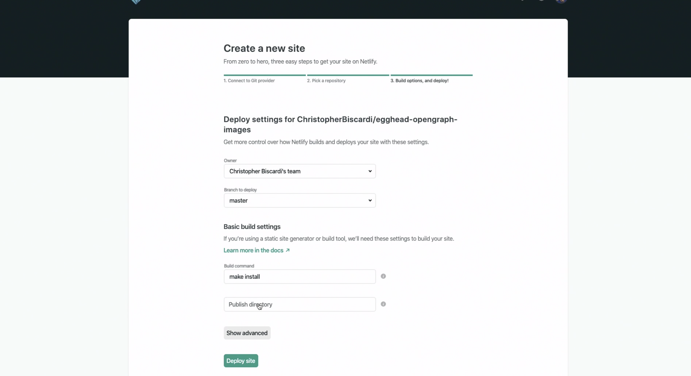

Chris Biscardi: 0:00 We've designed and implemented the React component for our OpenGraph image. **Next, we need to set up a git repo and deploy it to Netlify**, which is where we're going to deploy our functions. After making a directory, we can initialize a new git repo.

0:14 Next, we'll use the VS Code CLI to open this directory.

```bash
mkdir egghead-opengraph-images
cd egghead-opengraph-images
git init
code .
```

We'll start by initializing a new `package.json`. Then, we'll create an `index.html`. This `index.html` will deploy by default when we deploy it in Netlify, so we can check to make sure that the deployment worked.

```
yarn init -y
touch index.html
```

0:29 We'll also need that `netlify.toml` with a build section that specifies the directory the functions will live in and also the command we will use to build everything. In this case, because we will end up with multiple functions and those functions need to have their dependencies installed separately, we're going to use Make. **All our functions will live in the functions directory.**

```toml
[build]
  functions = "functions"
  command = "make install"
```

0:49 To use Make, we'll create a `Makefile` with an install command. It's important that each command we put into this install command is started by a tab at the beginning of a line.

```Makefile
install:
	echo "installed"
```

0:58 We don't have any packages to install yet. I'm going to use a CLI command called echo to `echo "installed"` to the console output. We can also `ga *` to add all the files in the current directory.

1:13 After giving a commit message, we'll need to create the repo on GitHub. We can do this using the [hub](https://hub.github.com) CLI, which I have aliased to `git`, so I can run `git create` which calls `hub create`. Note that this gave us a `URL` of our new git repo on GitHub.

```
git commit -m"Adding all files"
git create
```

1:27 If we click the `URL` to go to the page, we can see the GitHub repo opened on the browser on the left. If we check our git remotes, we can see that the `origin` is pointing at this git repo, so we need to `git push -u origin master.` If we refresh our repo, we can see all the new files that we just created.

1:43 Next, we have to go to [Netlify](https://www.netlify.com). We'll click New site from Git and choose from GitHub. I named my repo `egghead-opengraph-images`, so I'm going to go click that repo. Note that it auto discovered the build command from `netlify.toml`. The publish directory will just be the `root` of the repo, so we don't have to worry about anything else.

2:06 If we click `Deploy Site`, we can see that the site deploy is in progress. Now that the site is built, we can check to make sure our install command was run, which we can see here in the `Make` install. **We can also see that the function directory was discovered, which is important for us later, and that we had three new files to upload.**

2:22 If we go back to our new `URL`, we can see that it worked. Also note that if we go to `Makefile` in the `URL`, our `Makefile` is being served as part of our application. We won't have any secrets here, so it doesn't matter for us. It's nice to show the open source code directly available on the site.



2:40 **If you wanted to hide this code, you could put the `index.html` file in a subdirectory and change the publish directory.**
