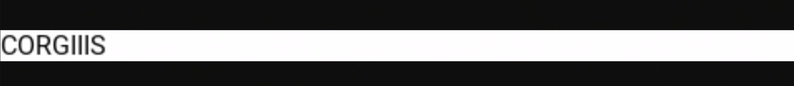

Chris Biscardi: 0:00 The next thing we're going to do is install [Playwright](https://github.com/microsoft/playwright), which is the library that will run headless browsers for us, whether it's Chromium-based, Firefox, or Webkit-based. If we install Playwright, the regular package, it installs all three browsers for us for convenience.

0:14 **This is a lot, and our deploy will actually fail if our package size gets too big.** If you look in packages, you can see that there's `Playwright Chromium`, `Playwright Firefox`, and `Playwright Webkit`, which are each different packages corresponding to their respective browsers.

0:27 We can shrink the package size a little bit by using one of these. Currently, the Playwright team [doesn't support a build for Lambda](https://github.com/microsoft/playwright/issues/626), but they do offer all of their build scripts for somebody else to handle it.

0:37 We're going to use [Playwright AWS Lambda](https://github.com/alixaxel/chrome-aws-lambda). **Playwright AWS Lambda only supports Chromium, but it'll work in our Netlify functions environment, which is what we need**.

```
npm install chrome-aws-lambda --save-prod
```

Now that we've added Playwright AWS Lambda to our dependencies, we'll use in our `gen-opengraph-image` handler.

0:51 **We just added a bunch of code here, so let's go over how it works.** First, we import Playwright from the Playwright AWS Lambda package. We launch Chromium. We get the default context.

1:00 Note that `_defaultContext` is actually an internal API that we have to use because we're using a third-party Playwright package. We create a new page off that context, which will create a new page in the headless Chromium that we've launched.

```js
const playwright = require("playwright-aws-lambda");

exports.handler = async function(event, ctx) {
  const browser = await playwright.launchChromium();
  const context = await browser._defaultContext;
  const page = await context.newPage();

// ... //
```

1:12 **We can set the content to any HTML we want.** In this case, we've set up a `head` and a `body` and a `div` inside the `body` with an `id="corgi"` and a content of `hello`. This div is where we'll render our image into before we take the screenshot. Hello is just test content for us.

```js
await page.setContent(`<!DOCTYPE html>
  <html>
    <head>
      <meta charset="utf-8" />
    </head>
  
    <body>
      <div id="corgi"><div>CORGIIIS</div></div>
    </body>
  </html>
  `)

// ... //
```

1:28 Then we need to get the dimensions to pass to the screenshot function. To do this, we can use `page.evaluate`, which allows us to evaluate a function or a `string` of code inside of the browser context page.

1:38 In this case, we get the `div` with an `Id` of `corgi`. We use `getBoundingClientRect` and native browser APIs to get the `X` and the `Y` position as well as the `width` and the `height`. Then we return that as a serializable `object` as the variable `boundingRect`.

```js
const boundingRect = await page.evaluate(() => {
  const corgi = document.getElementById('corgi')
  const { x, y, width, height } = corgi.children[0].getBoundingClientRect()
  return { x, y, width, height }
})
```

1:52 It's important that we return a serializable `object` here because we're passing data back and forth between the headless Chromium instance and our Node script. If we just passed the result of `getBoundingClientRect`, it would become `contextified` within the browser, which means that it wouldn't be able to get passed through.

2:06 Finally we `await page.screenshot`. We `clip` the screenshot using the `boundingRect` dimensions that we got in our previous page evaluate. This gives us a buffer which is all of the `data` from our screenshot and the `div` that we rendered.

```js
const screenshotBuffer = await page.screenshot({ clip: boundingRect })
await browser.close()
return {
  isBase64Encoded: true,
  statusCode: 200,
}
```

2:19 Finally, there's a couple of magic properties that we need to set. We need to set `isBase64Encoded` to `true` in our response. We'll set the `headers` `Content-Type` to `image/png` and the `Content-Lengt` to the buffer `length`.

```js
const screenshotBuffer = await page.screenshot({ clip: boundingRect })
await browser.close()
return {
  isBase64Encoded: true,
  statusCode: 200,
  headers: {
    'Content-Type': 'image/png',
    'Content-Length': screenshotBuffer.length.toString(),
  },
  body: screenshotBuffer.toString('base64'),
}
```

2:30 Interestingly, we have to set the buffer `length` as a `string` in `Content-Length` and not as a number. Also note that we don't pass the buffer directly back in the body of the response. We `toString()` it to a `base64` representation.

2:43 If we open a Node REPL and we try to require our `/gen-opengraph-image.js`, we can see that we need to install `playwright-core`. `playwright-core` is an additional package that our third party package depends on. If we run the `handle()` in a Node REPL by requiring the file and destructuring the handler, we can see that we've mistyped something.

```bash
node
const {handle} = require('./gen-opengraph-image')
handle()
# Results in SyntaxError
```

3:00 In this case, `context` is defined twice because defined in the arguments as well as a `const`. We'll change the argument to `ctx` to differentiate them. If we run the handler now, we see something promising. `Chromium revision is not downloaded`. For us, this doesn't matter. **It just means we won't be able to test the function locally.**

3:19 Luckily, because we're using Netlify functions, **if we ever need to make changes, we can do a deploy preview to test the function**. We'll add and commit our `gen-opengraph-image.js` code, the `package.json` with the new dependencies, as well as the `yarn.lock`.

3:30 Note that our build failed because we `Can't find Playwright AWS Lambda in our file`, which is strange because we already installed it. This is where our `Makefile` comes in. Netlify doesn't automatically handle our dependencies for us. We'e going to have to handle that ourselves.

3:43 In this case, we're going to `cd functions/gen-opengraph-image && npm i`. Note that in case yarn was not found. This isn't a problem for us in CI as we can run `npm install` instead.

3:54 Note that we get a couple warnings about not having a `package-lock.json` file because we're not using it locally. We can get yarn to work in CI, but in this case, we don't need to because we aren't using any of the features.

4:05 Now we've deployed the function. We see another `error` if we hit the `URL`.

```bash
cannot read property getBoundingClientRect of undefined.
```

That's because we have `corgi.children[0].getBoundingClientRect();`.

4:16 This isn't a problem for us as we can include another `div` inside of the `div` for the `corgi`.

```js
<body>
  <div id="corgi">
    <div>CORGIIIS</div>
  </div>
</body>
```

We've included this additional `div` because when we render into `corgi`, we want the user's component to have control over everything.

4:27 We could also choose to `getBoundingClientRect` on the corgi `div` itself, but we're just using this as a place that the user can render a component into as opposed to being the actual size of the actual image that we want to render. **This allows the component itself to control how big the screenshot will be.**

4:43 Now if we refresh our function `URL`, we can see a screenshot of corgis.



Note that we haven't specified any sizing. We don't have any serious content here, so the screenshot looks a little weird. It looks a little bit too wide. It looks a little small as well. **We'll fix this when we work on porting the component into Playwright.**
