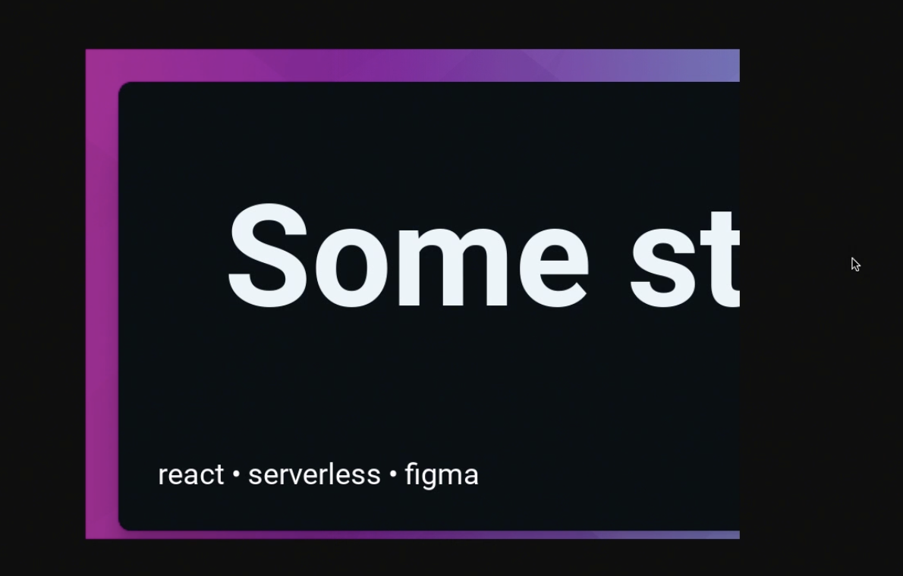
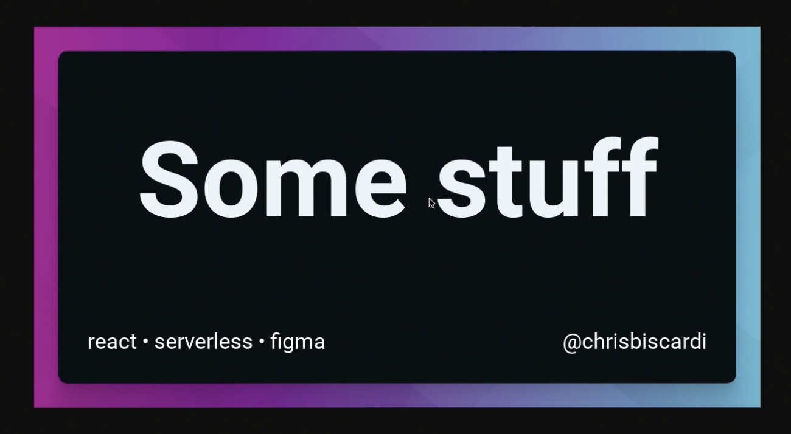

Chris Biscardi: 00:00 Our serverless function image generation is working, but you'll see that **the dimensions that are getting returned from a page that a value will call are smaller than the actual image**. This is because we haven't set the viewport yet.



00:10 Right before we set content, we can set the `ViewportSize` to whatever we want. In our case, **we'll set it for the same dimensions that we used in Figma**, a new CodeSandbox.

```js
page.ViewportSize({
  width: 1200,
  height: 630,
})
```

00:19 Now we see our image, which I'll save to my desktop.


