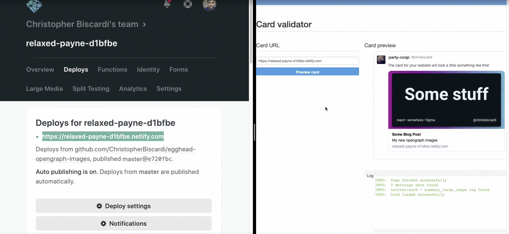

Chris Biscardi: 00:00 Now that we know our image generation function works in production, we're going to need it to **generate an actual OpenGraph image**. Luckily, we already have a site that we're deploying. In our `index.html` we'll replace it with a set of HTML.

```html
<meta charset="utf-8" />
<meta name="twitter:card" content="summary_large_image" />
<meta name="twitter:site" content="@chrisbiscardi" />
<meta name="twitter:creator" content="@chrisbiscardi" />
<meta name="twitter:title" content="Some Blog Post" />
<meta name="twitter:description" content="My new opengraph images" />
<meta
  name="twitter:image"
  content="https://relaxed-payne-d1bfbe.netlify.com/.netlify/functions/gen-opengraph-image"
/>
```

00:13 In this case we'll set up a set of `<meta>` tags for Twitter specifically. The Twitter image we're using is the `URL` to our function. **We aren't currently passing in any variables to this function, so this is just a test**.

00:26 Now that we've deployed our site, we can do a Google search for the Twitter Card validator. This will bring us to `cards-dev.twitter.com/validator`. Using this page, we can test our OpenGraph images.

00:36 **We'll take the production URL and hit Preview**. Note that you might have to hit this twice, as Twitter will go out and make the request and cache it.



00:44 This is not exactly how it's going to look when we share it on Twitter, because there are **some differences between the Card validator and the way that the representation of the dimensions shows up in the tweet unfurl**.

00:54 Let's make an actual tweet. Once we're on Twitter, we can go to the Tweet button and paste in our `URL`. I'll say something like, _"Just testing, going to delete this in a second."_


01:07 **Now we can see that my OpenGraph image has shown up.** It looks quite nice. Taking a look for the screenshot I took. I'm pretty happy with the way that our OpenGraph image turned out.

01:16 Unfortunately, **every time somebody hits our HTML page, this image is going to be regenerated**. That's not great, because it will mean that I have to run more functions for more time with more memory than I would **if we had generated it once and then cached it**.

01:33 **We can cache OpenGraph images because typically they don't change a lot from deploy to deploy.**
