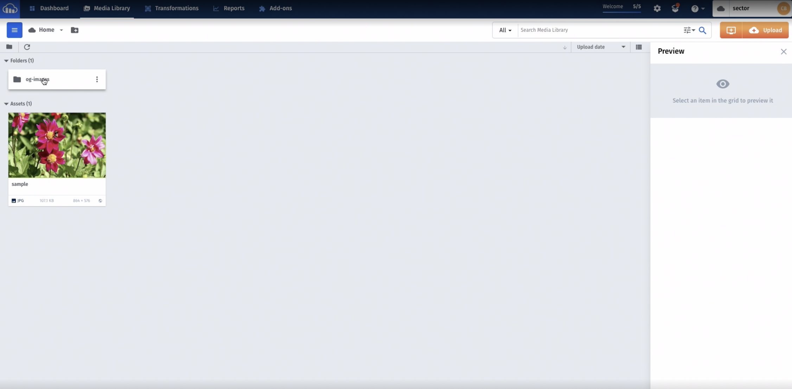
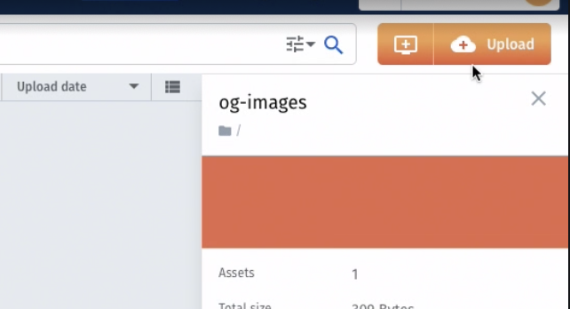
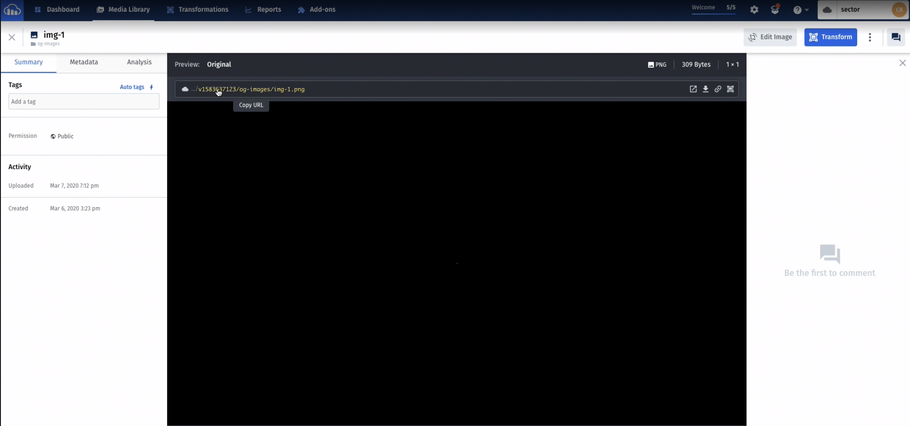
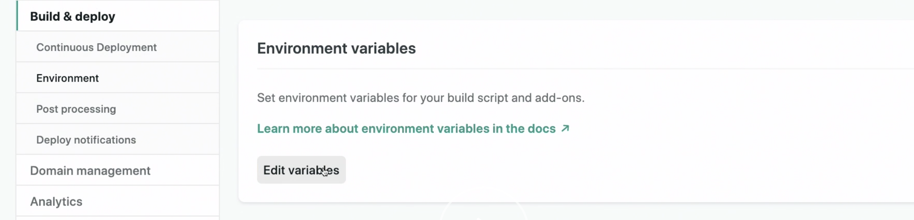
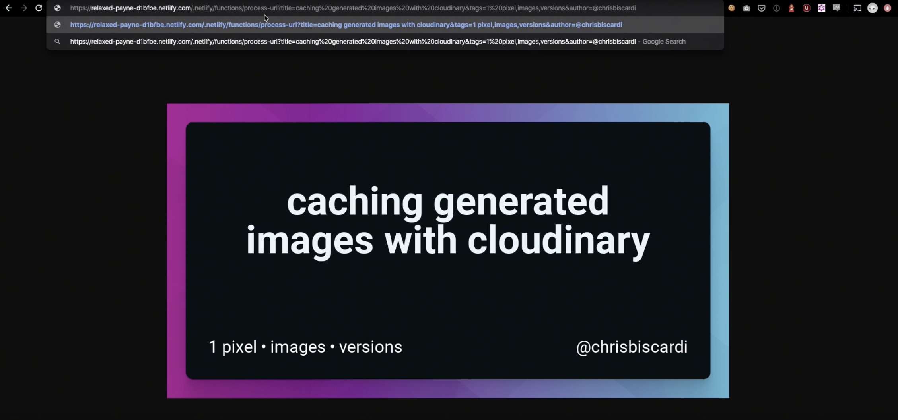

Chris Biscardi: 00:01 Now that we can generate anything we want with this open-graph image, any title, any tags, any author name, it's **time to make sure that it doesn't get called more than once to generate the same image.**

00:13 If you look in the bottom left of the screen, every time I refresh, you can tell it takes a little bit of time far longer than just returning an image would take. To fix this, we can use [Cloudinary](https://cloudinary.com), but **we're not going to use Cloudinary in the way that you might think**.

00:27 We could, of course, generate this image, save it out, and then uploaded the Cloudinary manually. **What we are going to do is use Cloudinary as a write-through cache**. This means that the `URL` we are going to use is going to hit Cloudinary first. If it has the image cache, it's going to return the image.

00:46 **If it doesn't have the image cached, Cloudinary is going to hit our function behind the scenes, will generate the image on the fly**, and will pass it back to Cloudinary who will then cache it and also return it to whoever's requesting it.

00:59 This means we don't need to manually manage any of our images, as long as we're not trying to update them.

01:05 **We'll start by uploading an image.** You can see in my dashboard, I've uploaded one image into a folder called `og-images`.



I've done that by clicking the **right hand upload button** over here, where you can drag and drop whatever you want.



01:17 My image is a `1px` transparent PNG. This is because it's 300 bytes, **which is really small, and we're not going to use this image anyway**. Since we're doing all of the image generation in our function, I just wanted to make this image, which will get passed to our function for processing, as small as possible.

01:37 Note the name of the image, `img1`. It's a PNG and it's in the folder `og-images`. If we click on Manage where you get the `URL` in a different way, you can see that there's a `version` number here.



01:50 **That `version` number is important because that `version` number is something that we'll use in our functions to make sure that we can invalidate the cache if we upload a new generation function.** Since Cloudinary doesn't really know other than the `URL` whether our function has changed on Netlify, we need to use this `version` as a cache invalidation technique.

02:12 We only have one function inside of functions right now, `gen-opengraph-image`. We need to make a new directory. We're going to call this function `process-url` because it'll handle processing the `URL` that we pass it and prepare it for Cloudinary.

02:25 We'll initialize the new `package.json` and we need to add one package, the Cloudinary package: `yarn add cloudinary package`. We'll name our file `process-url.js` so that we can deploy this on Netlify. Typically, a Cloudinary `URL` looks something like:

```
https://res.cloudinary.com/sector/image/upload/v1583637123/og-images/img-1.png
```

- res.cloudinary.com
- `name` of owner
- `image`
- `upload`
- `version` number
- `name` of folder name
- `file` name

02:50 Note that we have the folder name and the file name, as well as the image in our `URL` generation here. Let's bring it back from the top. **We import Cloudinary and we're using the `V2` API, which is pretty important.** We're also importing `querystring,` which will help us take the variables that we have and pass them in.

```js
const cloudinary = require('cloudinary').v2
const qs = require('querystring')
```

03:08 We need `querystring` because the event that comes in from the Lambda, which is what's underpinning the implementation of Netlify functions, gives us an object that we need to turn back into `querystring` to stick on the end of our `URL` to generate the image.

03:25 **Then we configure our Cloudinary account. We've got our Cloud name, the API key, and the API secret.**

```js
const cloudinary = require('cloudinary').v2
const qs = require('querystring')
cloudinary.config({
  cloud_name: 'sector',
  api_key: process.env.CLOUDINARY_KEY,
  api_secret: process.env.CLOUDINARY_SECRET,
})
```

Our `handler` uses the same function signature as before. It's an async function with an `event` and a `context`, and we're exporting the name `handler` for it. We pull the `querystring` parameters off the event. `queryStringParameters` here will be an object.

```js
exports.handler = async function (event, ctx) {
  const { queryStringParameters } = event
}
```

03:44 Then we wrap everything in a `try catch` because we really don't care if this fails. If it fails, we don't want to contact Cloudinary at all, we don't want to hit any other service, we're just going to fail. Then we can use `cloudinary.url` with the `version` of the image, which is what we talked about earlier, and the location of that image in our account.

```js
const cloudinary = require('cloudinary').v2
const qs = require('querystring')
cloudinary.config({
  cloud_name: 'sector',
  api_key: process.env.CLOUDINARY_KEY,
  api_secret: process.env.CLOUDINARY_SECRET,
})

exports.handler = async function (event, ctx) {
  const { queryStringParameters } = event

  try {
    // https://res.cloudinary.com/sector/image/upload/v1583637123/og-images/img-1.png
    const imageUrl = cloudinary.url(
      `${process.env.CHRIS_IMAGE_VERSION}/og-images/img-1.png`,
      {
        // resouce_type: "raw"
        sign_url: true,
        // secure: true,
        custom_pre_function: {
          function_type: 'remote',
          source: `https://relaxed-payne-d1bfbe.netlify.com/.netlify/functions/gen-opengraph-image?${qs.stringify(
            queryStringParameters
          )}`,
        },
      }
    )
    return {
      statusCode: 302,
      headers: {
        Location: imageUrl,
      },
      body: '',
    }
  } catch (e) {
    console.log(e)
  }
}
```

04:03 The next option is an `object` is required to sign the `URL`, which is why we're using this function at all. The other option we're going to use is called `custom_pre_function`. We can also use custom_function. **In this case, `custom_pre_function` allows us to do processing before Cloudinary does anything at all.**

04:22 Our function generation is always the first thing that gets called. We specify a `function_type` of remote. The other `function_type` that's available to us is WASM or WebAssembly. WebAssembly doesn't do quite what we need, which is why we needed a list Lambda in the first place.

04:38 Finally, the source of the remote function is the `URL` on Netlify with the `queryStrings`. The entire source gets signed into the `request` and we `return` a redirect to Cloudinary with an empty `body`. **Remember, if you look at this image `URL`, it's the `URL` we're generating that goes to Cloudinary that we're passing in as the location here.**

```js
headers: {
  Location: imageUrl,
}
```

05:00 With all that said, we also need to add the `cd functions/process-url && npm i` to our `Makefile`. This is where our `Makefile` starts to get very useful, compared to say, a set of npm `scripts`. We can do anything we want inside of `install:`.

05:14 Remember that the space in the front needs to be a tab and each line is run in its own `environment`. That's why we're using `&&` to chain calls together.

```bash
# commands
cd functions/gen-opengraph-image && npm run build
cd functions/process-url && npm i
```

05:24 First, we go into the directory and we do an `npm install` and we do an `npm run build`. Then we have a different environment where we go into a different directory and do a different install. Before we push, we're going to set our `ENV` variables in Netlify.

05:41 Back on our deploys page, which we've been watching as we go through this, we can go to the **Deploy Settings** and click the **Environment**.



These `ENV` variables are the variables that we'll need to set. That is, we're going to need to set the image `version`, which I've prepended my `name` to because I intend to have more versions, the `CLOUDINARY_KEY`, and the `CLOUDINARY_SECTRET`.

06:03 Now that we've set our environment variables, which will get baked into the function environment, we can push. While this is building, let's go over one more time what we just did. **We now have two functions. One function's job is to generate the image. The other functions job is to sign a URL and redirect us to Cloudinary.**

06:26 Once we're redirected to Cloudinary, **Cloudinary either serves us the image that we want or asks our other function to generate it.** If it asks our other function to generate it, that function will generate it and return it, where Cloudinary will cache it and also return it to us.

06:42 Note that we're changing the `URL` to point to Netlify functions `process-url`. Note how long this takes. It's also redirected us. If you look at the `URL`, we're looking at `res.cloudinary.com` right now.



06:55 **If we do this again, it loads almost instantly. This is how we know it's been cached.** Also note that while `gen-opengraph-image` handles an un-url-encoded `@` symbol correctly processed `URL`, having sent it through more different `URLs` and the signing doesn't.

07:14 Keep this in mind if you're thinking about using different symbols in the `URL` query string. You will have to deal with those when they get to your generation function in the end in the same way that we dealt with them earlier per `tags`. **That's it. We can use this `URL` now to serve up cached images for any website on the Internet.**
