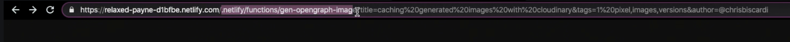
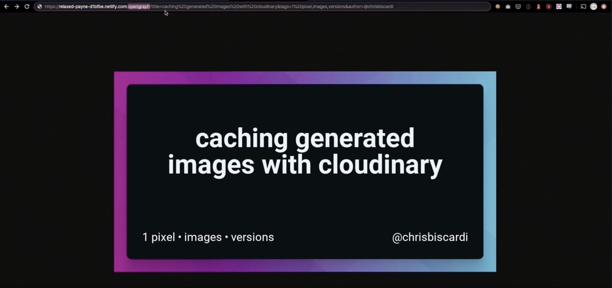

Chris Biscardi: 00:00 Now that we have everything working, we can take a look at the user experience of using these URLs.

00:06 Right now, people need to put in the Netlify subpath, remember the function `path`, and also use the query `string`. **To change the Netlify subpath we can enable a domain on Netlify.**

00:20 But what we are going to go over, is using `redirects` to trim out the function it self, what we want to end up with is replacing the `netlify/functions/gen-opengraph-image` with `opengraph`.

00:34 In this way, if we add a domain we can have `chris.com/opengraph` and then just write the query `string`.

00:42 To do this, at the root of our project we are going to make a `_redirect` file. Note that this `_redirect` file has to be in the `root` of the deployed site.

00:49 We will proxy re-write with status code of `200` with from `/opengraph` to `/.netlify/functions/process-url 200`.

**Now that we have deployed, we can use the new sub-path which is still cashed.**

